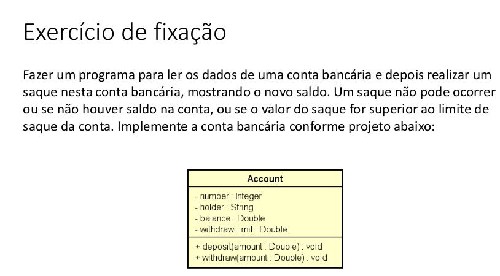
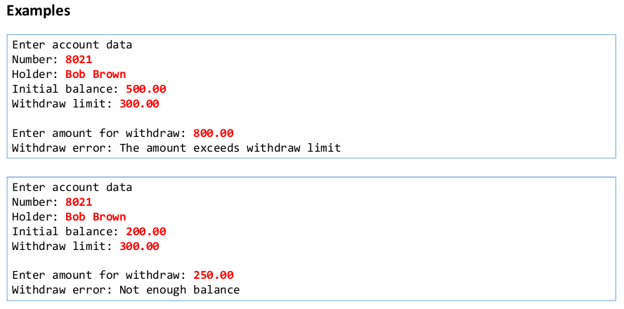

# WithdrawTryCatch



> Trata-se de um mini projeto simples programado em **Java**, que visa usar os principais conceitos da POO (Encapsulamento, herança e polimorfismo) em um sistema de saque bancário

###Exemplo 1


###Exemplo 2


## 💻 Pré-requisitos

Antes de começar, verifique se você atendeu aos seguintes requisitos:
* Você precisa compreender a linguagem Java e conceitos de POO (Encapsulamento, herança e polimorfismo)
* Você precisa compreender classes **Date, SimpleDateFormat, try-catch**
* Você precisa compreender conceito de **delegação**

### Resumo dos conceitos aplicados

- [x] Try-Catch
- [x] Delegação
- [x] Código limpo
## 🚀 Instalando 

Para instalar, siga estas etapas:

Linux, macOS e Windows:
```git
<git clone git@github.com:AlissonWenceslau/withdrawtrycatch.git >
```
###### Próximo passo
* Execute o projeto em uma IDE


[⬆ Voltar ao topo](#withdrawtrycatch)<br>